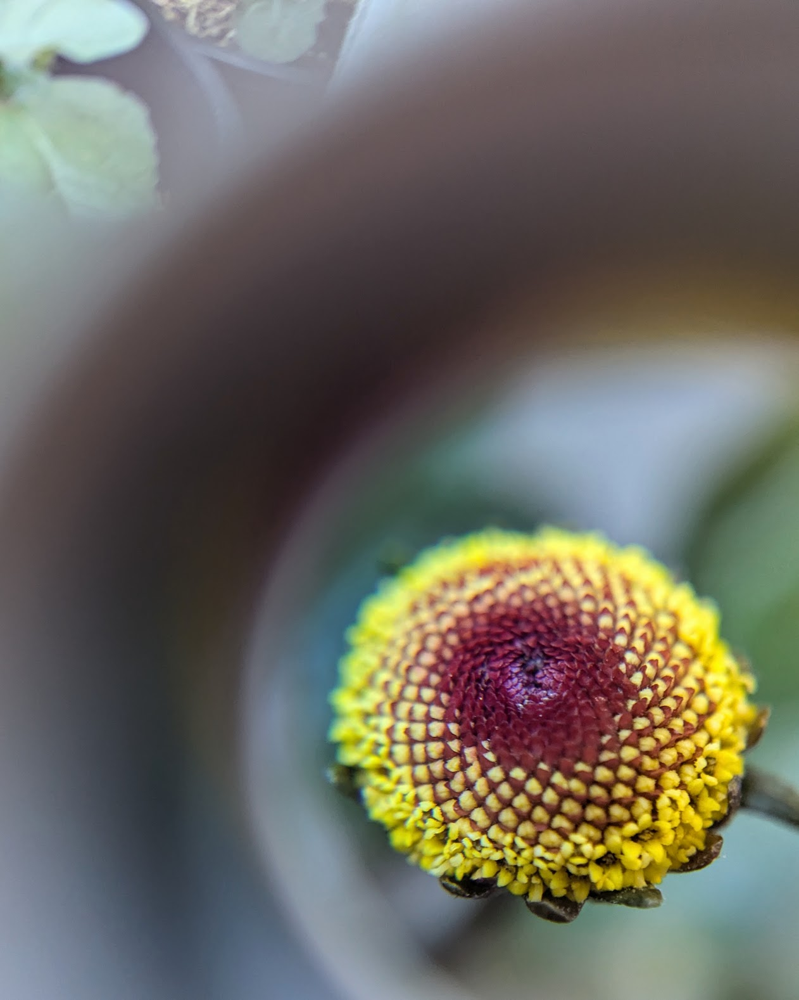

# Hello, world!
I'm Frankie and this is my /now page, a place where you can keep up with me and what I've been up to. I built this blog from scratch, leveraging <a href ="https://www.11ty.dev/" target="_blank" rel="noopener noreferrer">eleventy</a> to transform markdown files into HTML. 

## Fun
- This was the month of concerts! We saw: 
    - Anthony Green perform an intimate set at Polaris Hall in Portland, OR. 
    - Interpol at Edgefield, OR and again at Dune Peninsula in Tacoma, WA.  
    - Jesse Welles at Pioneer Courthouse Square in Portland. 
    - Muse in Ridgefield, WA!

- We took a spontaneous drive out to the Oregon Coast to stay for a couple of nights in Nye Beach & Newport. We visited the Tillamook Creamery on the way back.

<em>Nye Beach, Oregon</em>

## Career 
- I completed more job interviews as I search for my next role. Do you know anyone hiring? Let me know!
- I'm learning full stack web development and building some web sites (including this one).

## In the garden
- The dahlia tubers we saved from last year are starting to bloom, as are the roses we planted along the south-facing wall in the backyard.

<em>Dahlias in bloom</em>

<em>'As You Wish' rose</em>

- The California Sun Gold tomatoes are starting to ripen. Most of the San Marzano tomatoes are showing blossom end rot so far. Maybe due to inconsistent watering? Too much nitrogen? Acidic soil? 🤷‍♂️ 

<em>Today's tomato haul</em>

- I ate my first toothache plant flower (Spilanthes oleracea / Acmella oleracea) of the season. It gives your mouth a tingly and numbing sensation. I'm still not sure why I grow these things. Here is a photo I snapped of one of the flowers while holding a loupe magnifier to my phone lens.

<em>Toothache plant</em>

- The cucumber teepee I crafted from tree branches has somehow not yet collapsed under the weight of several massive cucumbers. 

<em>Massive cucumber</em>

## Projects

- I rebuilt the first of two sets of deck stairs in the backyard. Progress!
- I launched this blog!

