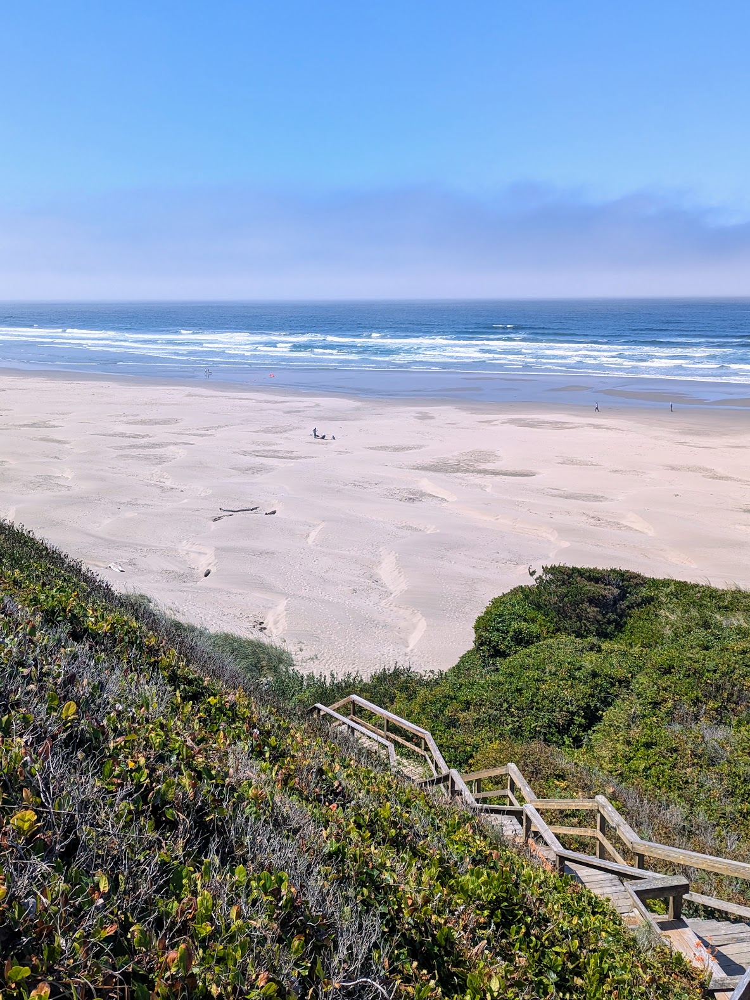
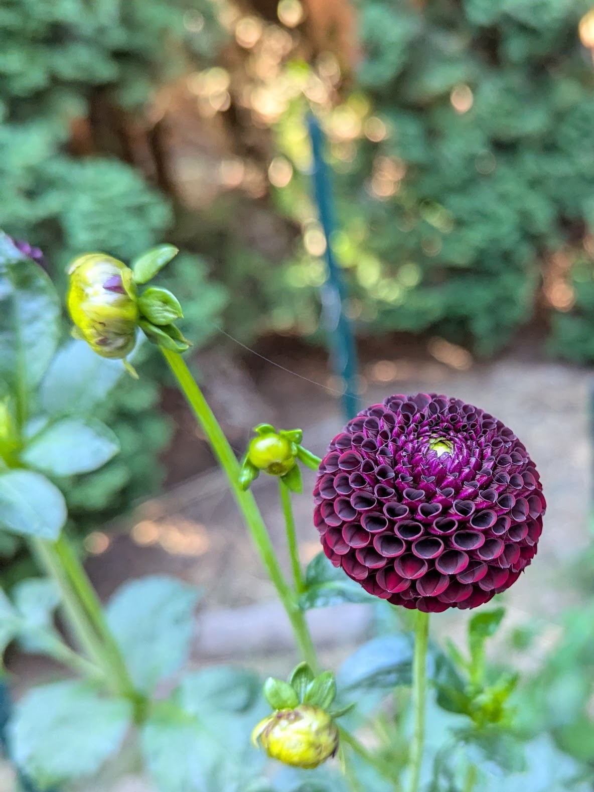
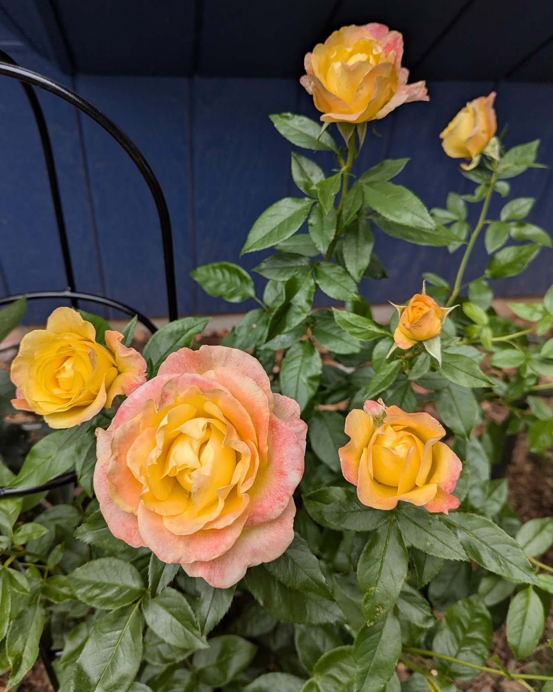
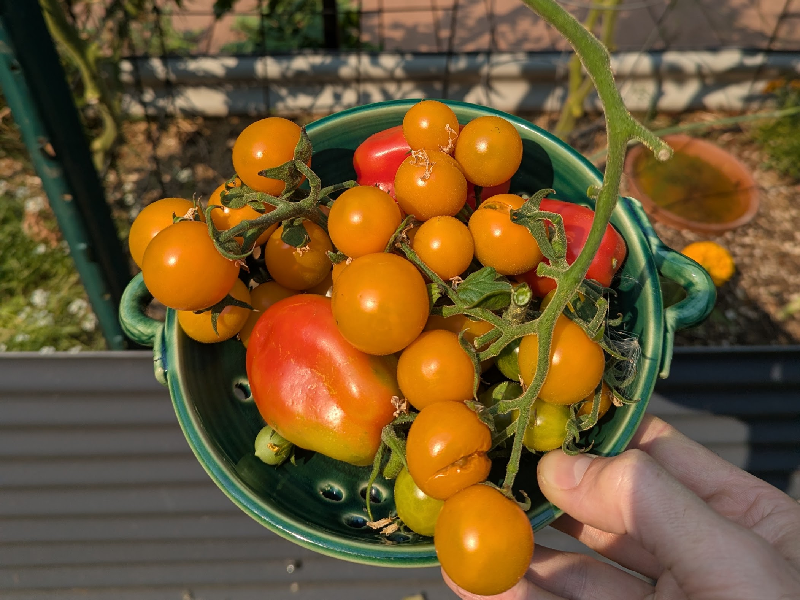
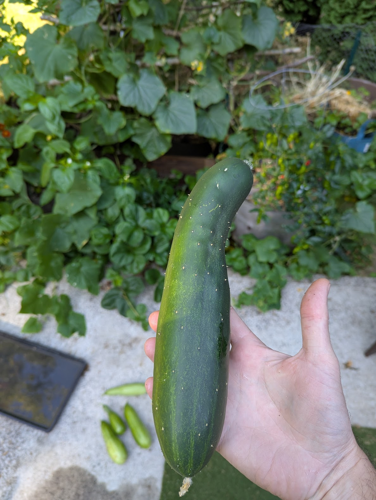

# Hello, world!
I'm Frankie and this is my /now page, a place where you can keep up with me and what I've been up to. I built this blog from scratch, leveraging eleventy to transform markdown files into HTML. 

## Fun
- This was the month of concerts! We had a chance to see Anthony Green perform an intimate set at Polaris Hall. Then, Interpol at Edgefield, OR and AGAIN in Tacoma, WA.  Then, Jesse Welles at Pioneer Courthouse Square in Portland. And then, Muse played in Ridgefield, WA!
- We took a spontaneous drive out to the Oregon Coast to stay for a couple of nights in Nye Beach & Newport. We visited the Tillamook Creamery on the way back.

<em>Nye Beach, Oregon</em>

## Career 
- I completed more job interviews as I search for my next role. Do you know anyone hiring? Let me know!
- I'm learning full stack web development and building some web sites (including this one).

## In the garden
- The dahlia tubers we saved from last year are starting to bloom, as are the roses we planted along the south-facing wall in the backyard.

<em>A dahlia from the garden</em>

<em>'As You Wish' rose</em>

- The California Sun Gold tomatoes are starting to ripen. Most of the San Marzano tomatoes are showing blossom end rot so far. Maybe due to inconsistent watering? Too much nitrogen? Acidic soil? 🤷‍♂️ 

<em>Some Sun Golds and San Marzanos</em>

- I ate my first toothache plant flower of the season. I'm not sure why I do this to myself. 
- The cucumber teepee I crafted from tree branches has somehow not yet collapsed under the weight of several massive cucumbers. 

<em>Massive cucumber</em>

## Projects

- I rebuilt the first of two sets of deck stairs in the backyard. Progress!
- I launched this blog!

